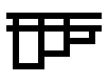

# Lambda Diagram

original idea: <https://tromp.github.io/cl/diagrams.html>

```
\f.\x.(f(f(fx)))
```



## Syntax

 - Lambda variables must be a single characters.
    e.g. `x`, `y`, `z`
 - Define lambda functions with `\x.x`
 - Application **MUST** be wrapped with aprenticies (`()`).
   However, subsequent application can be wrapped in same aprenticies.
    e.g. `\x.(xxxx)`

```
<expr> ::= <variable>
         | <number>
         | <abstraction>
         | <application>
         | <arithmetic_expr>
         | "(" <expr> ")"

<variable> ::= "$"<identifier>

<number> ::= <digit> | <digit> <number>

<digit> ::= "0" | "1" | "2" | "3" | "4" | "5" | "6" | "7" | "8" | "9"

<identifier> ::= <letter> | <letter> <identifier>

<letter> ::= "a" |"b" |"c" |"d" |"e" |"f" |"g" |"h" |"i" |"j" |"k" |"l" |"m" |"n" |"o" |"p" |"q" |"r" |"s" |"t" |"u" |"v" |"w" |"x" |"y" |"z" | "A" |"B" |"C" |"D" |"E" |"F" |"G" |"H" |"I" |"J" |"K" |"L" |"M" |"N" |"O" |"P" |"Q" |"R" |"S" |"T" |"U" |"V" |"W" |"X" |"Y" |"Z" |

<abstraction> ::= "\" <identifier> "." <expr>

<application> ::= "(" <expr> <expr>

<arithmetic-expr> ::= <arith_op> <expr> <expr>

<arith-op> ::= "+" | "-" | "*"

<variable-define> ::= <variable> "=" <expr>
```

## IDEA

 - lambda calculus numeral with binary or even floating point?
